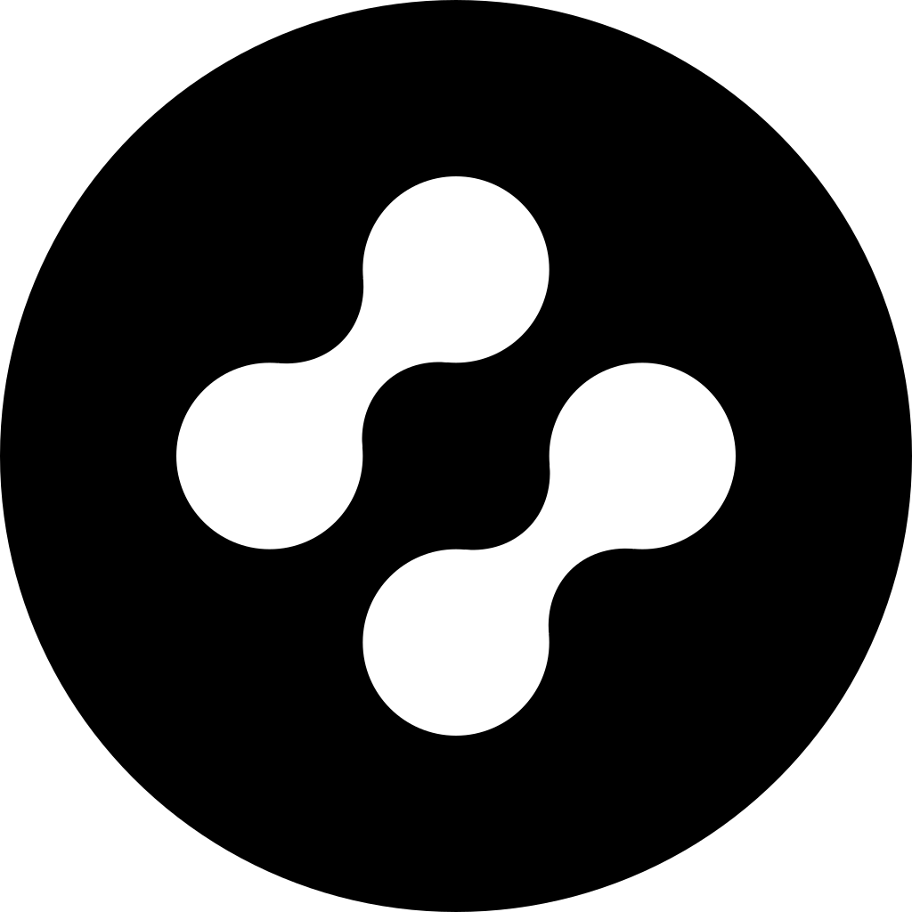

<picture>
  <source media="(prefers-color-scheme: dark)" srcset="assets/nodus-mark-dark.svg">
  
</picture>

# Nodus

**Open source at heart. We build the tools that AI uses.**
 
Portable memory, shared automation, and infrastructure for agents — built to outlive any single model or vendor.

 

---

## What we're building

- **[context](https://github.com/getnodus/context)** — a personal memory layer for AI agents. One set of facts about you, portable across every agent that speaks [MCP](https://modelcontextprotocol.io). `npm i -g @getnodus/context`
- **[workflow](https://github.com/getnodus/workflow)** — the shared GitHub automation control plane for the org: reusable workflows, the Renovate preset, and the repo standard.

More is in private development. [Get notified at nodus.to](https://nodus.to).

## Get in touch

[nodus.to](https://nodus.to) · [@getnodus](https://x.com/getnodus) · [hi@nodus.to](mailto:hi@nodus.to)
